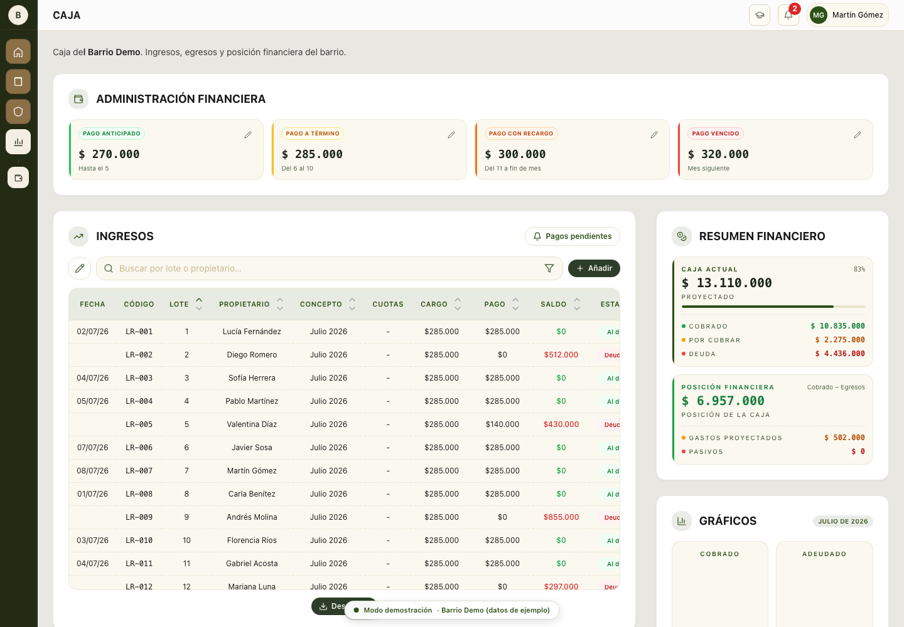

# Barrio Demo

Static portfolio demo of a neighborhood-management application. The interface is intentionally kept in Spanish because it represents the product's original market and domain language.

> Every person, lot, payment, complaint, visit, document, and phone number shown here is fictional demo data.



## Explore the demo

The static build exposes the main product areas without a login screen:

- Resident dashboard and account history
- Public information and community calendar
- Security operations and visitor management
- Administration, users, complaints, payments, expenses, and reporting views

Navigation and read-only workflows use browser-side seed data. Actions that would normally create, edit, approve, upload, or delete data show a demo notice and do not persist anything. This repository contains no database connection, authentication service, API routes, production credentials, or private neighborhood documents.

## Local development

Requirements: Node.js 20 or newer.

```bash
npm install
npm run dev
```

Open `http://localhost:3000`. Other useful commands:

```bash
npm run typecheck
npm test
npm run build
```

`npm run build` writes the deployable static site to `out/`.

## Deploy to Cloudflare Pages

Create a Pages project from this repository with these settings:

| Setting | Value |
| --- | --- |
| Framework preset | Next.js (Static HTML Export) |
| Build command | `npm run build` |
| Build output directory | `out` |
| Node version | `20` |

No environment variables are required. The included `_redirects` and `_headers` files are copied into the static output for Cloudflare Pages.

## Technology

Next.js 14 App Router, React, TypeScript, Tailwind CSS, TanStack Query, Recharts, and Lucide icons.

## License

No license is provided for this repository.

---

# Barrio Demo - Español

Demo estática para portfolio de una aplicación de administración barrial. La interfaz se mantiene en español porque representa el mercado y el lenguaje de dominio originales del producto.

> Todas las personas, lotes, pagos, consultas, visitas, documentos y números de teléfono que aparecen acá son datos ficticios de demostración.

## Recorré la demo

La versión estática permite recorrer las principales áreas del producto sin pantalla de inicio de sesión:

- Panel del vecino e historial de cuenta
- Información pública y calendario comunitario
- Operación de seguridad y gestión de visitas
- Administración, usuarios, reclamos, pagos, egresos e informes

La navegación y los flujos de lectura usan datos precargados en el navegador. Las acciones que normalmente crearían, editarían, aprobarían, subirían o eliminarían información muestran un aviso de demo y no guardan cambios. Este repositorio no contiene conexión a una base de datos, servicio de autenticación, rutas de API, credenciales de producción ni documentos privados del barrio.

## Desarrollo local

Requisito: Node.js 20 o una versión posterior.

```bash
npm install
npm run dev
```

Abrí `http://localhost:3000`. Otros comandos útiles:

```bash
npm run typecheck
npm test
npm run build
```

`npm run build` genera el sitio estático listo para publicar en `out/`.

## Publicación en Cloudflare Pages

Creá un proyecto de Pages desde este repositorio con esta configuración:

| Configuración | Valor |
| --- | --- |
| Framework preset | Next.js (Static HTML Export) |
| Comando de build | `npm run build` |
| Directorio de salida | `out` |
| Versión de Node | `20` |

No hace falta configurar variables de entorno. Los archivos `_redirects` y `_headers` incluidos se copian a la salida estática para Cloudflare Pages.

## Tecnologías

Next.js 14 App Router, React, TypeScript, Tailwind CSS, TanStack Query, Recharts e íconos de Lucide.

## Licencia

Este repositorio no incluye una licencia.
